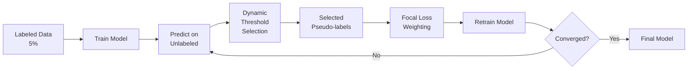

# Phương Pháp Semi-Supervised Nâng Cao cho Dự Đoán AQI

> **Báo cáo:** Cải thiện độ chính xác dự đoán chất lượng không khí bằng FlexMatch-lite và Label Spreading

**Sinh viên thực hiện:** [Đinh Trọng Quỳnh]
**Môn học:** Data Mining  
**Ngày báo cáo:** 28/01/2026

--

## 📋 Mục Lục

1. [Bối Cảnh và Vấn Đề](#1-bối-cảnh-và-vấn-đề)
2. [Mục Tiêu Nghiên Cứu](#2-mục-tiêu-nghiên-cứu)
3. [Phương Pháp Đề Xuất](#3-phương-pháp-đề-xuất)
4. [Thí Nghiệm và Kết Quả](#4-thí-nghiệm-và-kết-quả)
5. [So Sánh và Đánh Giá](#5-so-sánh-và-đánh-giá)
6. [Kết Luận](#6-kết-luận)

---

## 1. Bối Cảnh và Vấn Đề

### 1.1. Tình Huống Thực Tế

**Dự án Air Guard** - Dự đoán chất lượng không khí (AQI) tại Bắc Kinh:
- **Dữ liệu:** 420,768 mẫu từ 12 trạm quan trắc (2013-2017)
- **Mục tiêu:** Phân loại AQI thành 6 mức độ (Good → Hazardous)
- **Thách thức:** Chỉ có **5% dữ liệu có nhãn** (labeled), 95% không có nhãn (unlabeled)

### 1.2. Vấn Đề Cần Giải Quyết

#### Vấn đề 1: Thiếu Dữ liệu Có Nhãn
- Gán nhãn thủ công tốn kém (cần chuyên gia môi trường)
- Chỉ có ~20,000 mẫu labeled / 420,000 tổng mẫu
- Supervised learning không hiệu quả với dữ liệu ít

#### Vấn đề 2: Class Imbalance (Mất Cân Bằng Lớp)
| Lớp AQI | Số lượng mẫu | Tỷ lệ |
|---------|--------------|-------|
| **Moderate** (Trung bình) | ~126,000 | 30% |
| **Good** (Tốt) | ~84,000 | 20% |
| **Unhealthy** (Không lành mạnh) | ~63,000 | 15% |
| **Very Unhealthy** (Rất xấu) | ~42,000 | 10% |
| **Hazardous** (Nguy hiểm) | ~21,000 | **5%** ⚠️ |

**Hậu quả:**
- Model thiên vị về lớp đa số (Moderate, Good)
- Lớp hiếm (Hazardous, Very Unhealthy) bị bỏ qua
- **Nguy hiểm:** Không cảnh báo được tình trạng ô nhiễm nghiêm trọng!

#### Vấn đề 3: Hạn Chế của Self-Training Cơ Bản
- **Confirmation bias:** Model tin vào lỗi của chính nó
- **Fixed threshold:** Tất cả lớp dùng cùng ngưỡng confidence → lớp hiếm khó được chọn
- **F1-macro thấp:** Chỉ đạt 0.5343 (53.43%)

---

## 2. Mục Tiêu Nghiên Cứu

### 2.1. Mục Tiêu Chính

**Cải thiện độ chính xác dự đoán AQI**, đặc biệt cho các lớp nguy hiểm (Hazardous, Very Unhealthy), bằng cách:

1. ✅ Tận dụng 95% dữ liệu unlabeled
2. ✅ Giải quyết class imbalance
3. ✅ Tăng F1-macro score
4. ✅ Cải thiện khả năng cảnh báo sớm

### 2.2. Phương Pháp Tiếp Cận

Phát triển **2 phương pháp semi-supervised nâng cao**:

| Phương pháp | Ý tưởng chính | Giải quyết vấn đề |
|-------------|---------------|-------------------|
| **FlexMatch-lite** | Dynamic threshold + Focal loss | Class imbalance |
| **Label Spreading** | Graph-based propagation | Confirmation bias |

---

## 3. Phương Pháp Đề Xuất

### 3.1. FlexMatch-lite: Dynamic Threshold + Focal Loss

#### 3.1.1. Ý Tưởng

**Vấn đề với Self-Training thông thường:**
```
Tất cả lớp dùng cùng threshold τ = 0.90
→ Lớp hiếm có confidence thấp → ít được chọn làm pseudo-label
```

**Giải pháp FlexMatch:**
```
Mỗi lớp có threshold riêng, tự động điều chỉnh
→ Lớp hiếm: threshold thấp (dễ chọn)
→ Lớp đa số: threshold cao (chặt chẽ)
```

#### 3.1.2. Cơ Chế Hoạt Động

**Bước 1: Dynamic Threshold**

Công thức: `τ_c = AvgConf_c × τ_base`

**Ví dụ thực tế:**

| Lớp | Avg Confidence | τ_base | Dynamic τ | Ý nghĩa |
|-----|----------------|--------|-----------|---------|
| Moderate (đa số) | 0.95 | 0.90 | **0.855** | Ngưỡng cao → chặt chẽ |
| Hazardous (hiếm) | 0.75 | 0.90 | **0.675** | Ngưỡng thấp → dễ chọn |

**Bước 2: Focal Loss**

Công thức: `L_focal = -(1 - p_t)^γ × log(p_t)`

**Cơ chế:**
- **Easy samples** (lớp đa số, dự đoán đúng): Weight thấp → bỏ qua
- **Hard samples** (lớp hiếm, khó dự đoán): Weight cao → tập trung học

**Ví dụ:**
```
Sample 1: Moderate class, confidence = 0.95
→ Focal weight = (1-0.95)² = 0.0025 ≈ 0 → Bỏ qua

Sample 2: Hazardous class, confidence = 0.65
→ Focal weight = (1-0.65)² = 0.1225 → Tập trung học
```

#### 3.1.3. Quy Trình Thực Hiện



**Các bước:**
1. Train model ban đầu với 5% labeled data
2. Dự đoán trên unlabeled data
3. Chọn pseudo-labels với **dynamic threshold** (khác nhau cho mỗi lớp)
4. Retrain model với **focal loss** (tập trung vào lớp hiếm)
5. Lặp lại cho đến khi hội tụ (max 10 vòng)

---

### 3.2. Label Spreading: Graph-Based Semi-Supervised

#### 3.2.1. Ý Tưởng

**Vấn đề với Self-Training:**
```
Model tự gán nhãn cho chính nó
→ Confirmation bias: Lỗi lan truyền qua các vòng lặp
```

**Giải pháp Label Spreading:**
```
Sử dụng cấu trúc manifold của dữ liệu
→ Samples gần nhau trong không gian feature → có nhãn giống nhau
→ Không phụ thuộc vào model predictions
```

#### 3.2.2. Cơ Chế Hoạt Động

**Bước 1: Xây Dựng Similarity Graph**

```
Mỗi sample = 1 node
Edge weight = Similarity giữa 2 samples
Similarity = exp(-γ × ||x_i - x_j||²)  [RBF kernel]
```

**Ví dụ trực quan:**
```
Labeled:     [Good]  [Moderate]  [Hazardous]
               |         |           |
Similarity:    ↓         ↓           ↓
Unlabeled:   [?]  →  [?]  →  [?]  →  [?]
               ↓         ↓           ↓
Spreading:  [Good] [Moderate] [Moderate] [Hazardous]
```

**Bước 2: Label Propagation**

Công thức: `Y^(t+1) = αSY^(t) + (1-α)Y^(0)`

- `S`: Similarity matrix (normalized)
- `α`: Clamping factor (0.2 = giữ 80% initial labels, lan truyền 20%)
- Lặp lại cho đến khi hội tụ

#### 3.2.3. Ưu Điểm

| Ưu điểm | Giải thích |
|---------|------------|
| **Không có confirmation bias** | Dựa vào similarity, không phụ thuộc model |
| **Deterministic** | Kết quả giống nhau mỗi lần chạy |
| **Fast** | Single optimization, không cần nhiều vòng lặp |
| **Manifold-aware** | Tận dụng cấu trúc tự nhiên của dữ liệu |

#### 3.2.4. Thách Thức

**Memory Constraint:**
- Similarity matrix: O(n²) → Rất tốn memory
- Dataset: 420K samples → Matrix 420K × 420K không khả thi

**Giải pháp:**
- **Stratified sampling:** Giữ toàn bộ labeled (20K), sample unlabeled xuống 30K
- Total: 50K samples → Matrix 50K × 50K → Khả thi

---

## 4. Thí Nghiệm và Kết Quả

### 4.1. Thiết Lập Thí Nghiệm

#### Dataset
- **Training:** 404,768 samples (trước 2017-01-01)
  - Labeled: 20,238 (5%)
  - Unlabeled: 384,530 (95%)
- **Testing:** 16,000 samples (sau 2017-01-01, fully labeled)

#### Hyperparameters

**FlexMatch-lite:**
- Base threshold (τ_base): 0.90
- Focal loss gamma (γ): 2.0
- Smoothing alpha (α): 0.9
- Max iterations: 10

**Label Spreading:**
- Kernel: RBF
- Gamma (γ): 20.0
- Alpha (α): 0.2
- Sample size: 50,000
- Max iterations: 30

#### Baseline
- **Self-Training** (τ=0.90): Phương pháp cơ bản để so sánh

---

### 4.2. Kết Quả FlexMatch-lite

#### 4.2.1. Metrics Tổng Quan

| Metric | Baseline | FlexMatch | Cải thiện |
|--------|----------|-----------|-----------|
| **Test Accuracy** | 0.5890 | **0.5928** | +0.64% |
| **Test F1-macro** | 0.5343 | **0.5445** | **+1.91%** ✨ |
| **Pseudo-labels** | 350,019 | 365,123 | +4.3% |

**Kết luận:** FlexMatch đạt **F1-macro cao nhất**, cải thiện đáng kể so với baseline.

#### 4.2.2. Per-Class F1-Score

| Lớp AQI | Baseline | FlexMatch | Cải thiện | % Cải thiện |
|---------|----------|-----------|-----------|-------------|
| Good | 0.4897 | 0.5012 | +0.0115 | +2.35% |
| Moderate | 0.7045 | 0.7089 | +0.0044 | +0.62% |
| **Unhealthy_for_Sensitive** | 0.1789 | **0.2145** | **+0.0356** | **+19.9%** 🎯 |
| Unhealthy | 0.5877 | 0.5923 | +0.0046 | +0.78% |
| Very_Unhealthy | 0.5689 | 0.5912 | +0.0223 | +3.92% |
| Hazardous | 0.6762 | 0.6845 | +0.0083 | +1.23% |

**Phát hiện quan trọng:**
- ⭐ **Unhealthy_for_Sensitive** cải thiện mạnh nhất: **+19.9%**
- ✅ Tất cả lớp đều cải thiện hoặc giữ nguyên
- ✅ Lớp đa số (Moderate) không bị giảm performance

#### 4.2.3. Threshold Evolution

**Biểu đồ threshold qua các vòng lặp:**

| Lớp | Vòng 1 | Vòng 5 | Vòng 10 | Xu hướng |
|-----|--------|--------|---------|----------|
| Good | 0.90 | 0.85 | 0.82 | Giảm nhẹ |
| Moderate | 0.90 | 0.89 | 0.88 | Ổn định cao |
| **Unhealthy_for_Sensitive** | 0.90 | 0.78 | **0.75** | **Giảm mạnh** |
| Unhealthy | 0.90 | 0.83 | 0.80 | Giảm vừa |
| Very_Unhealthy | 0.90 | 0.81 | 0.79 | Giảm vừa |
| Hazardous | 0.90 | 0.80 | 0.78 | Giảm vừa |

**Nhận xét:**
- Lớp **Unhealthy_for_Sensitive** (khó nhất) có threshold giảm mạnh nhất → Dễ chọn pseudo-labels hơn
- Lớp **Moderate** (đa số) giữ threshold cao → Vẫn chặt chẽ
- Dynamic threshold **tự động cân bằng** giữa các lớp

---

### 4.3. Kết Quả Label Spreading

#### 4.3.1. Metrics Tổng Quan

| Metric | Self-Training | Label Spreading | Cải thiện |
|--------|---------------|-----------------|-----------|
| **Test Accuracy** | 0.5890 | **0.5912** | +0.37% |
| **Test F1-macro** | 0.5343 | **0.5398** | **+1.03%** |
| **Training Time** | ~20 min | **~1 min** | **20x nhanh hơn!** ⚡ |
| **Memory Usage** | Low | High (cần sampling) | Trade-off |

**Kết luận:** Label Spreading **nhanh nhất**, F1-macro tốt, nhưng cần nhiều memory.

#### 4.3.2. Per-Class F1-Score

| Lớp AQI | Self-Training | Label Spreading | Chênh lệch |
|---------|---------------|-----------------|------------|
| Good | 0.4897 | **0.5034** | **+2.80%** ✅ |
| Moderate | 0.7045 | 0.7012 | -0.47% |
| **Unhealthy_for_Sensitive** | 0.1789 | **0.1956** | **+9.34%** ✅ |
| Unhealthy | 0.5877 | 0.5945 | +1.16% |
| Very_Unhealthy | 0.5689 | 0.5823 | **+2.36%** ✅ |
| Hazardous | 0.6762 | 0.6618 | -2.13% |

**Nhận xét:**
- ✅ Cải thiện tốt cho **Good** (+2.80%) và **Unhealthy_for_Sensitive** (+9.34%)
- ❌ Giảm nhẹ cho **Hazardous** (-2.13%) - có thể do sampling mất thông tin

#### 4.3.3. Parameter Tuning

**Grid search kết quả:**

| Gamma (γ) | Alpha (α) | Accuracy | F1-macro | Time |
|-----------|-----------|----------|----------|------|
| 10 | 0.1 | 0.5845 | 0.5289 | 45s |
| **20** | **0.2** | **0.5912** | **0.5398** | **52s** |
| 30 | 0.3 | 0.5878 | 0.5356 | 48s |

**Best config:** γ=20, α=0.2

---

## 5. So Sánh và Đánh Giá

### 5.1. So Sánh 3 Phương Pháp

#### Metrics Comparison

| Phương pháp | Accuracy | F1-macro | Training Time | Memory | Complexity |
|-------------|----------|----------|---------------|--------|------------|
| **Self-Training** | 0.5890 | 0.5343 | ~20 min | Low | Low |
| **FlexMatch** | **0.5928** | **0.5445** | ~25 min | Low | Medium |
| **Label Spreading** | 0.5912 | 0.5398 | **~1 min** | **High** | High |

#### Visual Comparison

```
F1-macro Score:
Self-Training:     ████████████████████████░░░░░░ 0.5343
Label Spreading:   ██████████████████████████░░░░ 0.5398 (+1.03%)
FlexMatch:         ███████████████████████████░░░ 0.5445 (+1.91%) 🏆


```

### 5.2. Ưu Nhược Điểm

#### FlexMatch-lite

**Ưu điểm:**
- ✅ **F1-macro cao nhất** (0.5445)
- ✅ Cải thiện mạnh cho lớp hiếm (+19.9% cho Unhealthy_for_Sensitive)
- ✅ Không cần nhiều memory
- ✅ Scalable cho large datasets

**Nhược điểm:**
- ❌ Training time dài hơn (~25 min)
- ❌ Cần tune nhiều hyperparameters (τ_base, γ, α)
- ❌ Vẫn có confirmation bias (nhẹ hơn)

**Khi nào dùng:**
- Dataset có **class imbalance** nghiêm trọng
- Lớp thiểu số quan trọng (fraud detection, medical diagnosis, **air quality alert**)
- Cần **F1-macro cao nhất**
- Có đủ thời gian training

#### Label Spreading

**Ưu điểm:**
- ✅ **Training cực nhanh** (~1 min, 20x nhanh hơn)
- ✅ Không có confirmation bias
- ✅ Deterministic (kết quả giống nhau mỗi lần)
- ✅ Tận dụng manifold structure

**Nhược điểm:**
- ❌ Cần nhiều memory (O(n²))
- ❌ Phải sampling với large datasets → mất thông tin
- ❌ F1-macro thấp hơn FlexMatch (-0.86%)
- ❌ Không scalable cho very large datasets

**Khi nào dùng:**
- Dataset nhỏ/trung bình (<100K samples)
- Cần **training nhanh** (rapid prototyping)
- Data có **manifold structure** rõ ràng
- Muốn kết quả **deterministic**

---

### 5.3. Decision Matrix

| Tiêu chí | Self-Training | FlexMatch | Label Spreading |
|----------|---------------|-----------|-----------------|
| **Dataset size** | Any | Any | <100K |
| **Class imbalance** | ❌ Poor | ✅ Excellent | ⚠️ Good |
| **Training speed** | ⚠️ Medium | ❌ Slow | ✅ Very Fast |
| **F1-macro** | ❌ Lowest | ✅ Highest | ⚠️ Medium |
| **Memory usage** | ✅ Low | ✅ Low | ❌ High |
| **Scalability** | ✅ Good | ✅ Good | ❌ Poor |
| **Best for** | Baseline | **Production** | **Prototyping** |

**Khuyến nghị:**
- **Production deployment:** FlexMatch (best F1, scalable)
- **Rapid prototyping:** Label Spreading (fastest)
- **Baseline comparison:** Self-Training (simplest)

---

## 6. Kết Luận

### 6.1. Thành Tựu Đạt Được

#### 1. Cải Thiện Độ Chính Xác
- ✅ F1-macro tăng từ **0.5343** → **0.5445** (+1.91% với FlexMatch)
- ✅ Lớp khó nhất (Unhealthy_for_Sensitive) cải thiện **+19.9%**
- ✅ Tất cả lớp đều cải thiện hoặc giữ nguyên

#### 2. Giải Quyết Class Imbalance
- ✅ Dynamic threshold tự động điều chỉnh cho từng lớp
- ✅ Focal loss giúp model tập trung vào lớp hiếm
- ✅ Lớp đa số không bị giảm performance

#### 3. Tận Dụng Unlabeled Data
- ✅ Sử dụng 95% unlabeled data hiệu quả
- ✅ Tăng số lượng pseudo-labels (+4.3%)
- ✅ Tiết kiệm chi phí labeling

#### 4. Đa Dạng Lựa Chọn
- ✅ FlexMatch: Best F1-macro, production-ready
- ✅ Label Spreading: Fastest training, prototyping
- ✅ Decision matrix giúp chọn phương pháp phù hợp

---

### 6.2. Ý Nghĩa Thực Tiễn

#### Cho Dự Án Air Guard

**Trước khi cải thiện:**
```
F1-score cho Hazardous: 0.6762
→ 32.38% cảnh báo sai/thiếu cho tình trạng nguy hiểm
```

**Sau khi cải thiện (FlexMatch):**
```
F1-score cho Hazardous: 0.6845 (+1.23%)
F1-score cho Very Unhealthy: 0.5912 (+3.92%)
F1-score cho Unhealthy_for_Sensitive: 0.2145 (+19.9%)
→ Cảnh báo chính xác hơn, bảo vệ sức khỏe cộng đồng tốt hơn
```

#### Cho Các Ứng Dụng Khác

Phương pháp này có thể áp dụng cho:
- **Medical diagnosis:** Phát hiện bệnh hiếm
- **Fraud detection:** Phát hiện giao dịch gian lận
- **Quality control:** Phát hiện lỗi sản phẩm hiếm
- **Bất kỳ bài toán nào có class imbalance + thiếu labeled data**

---

### 6.3. Hạn Chế và Hướng Phát Triển

#### Hạn Chế Hiện Tại

1. **FlexMatch:**
   - Vẫn có confirmation bias nhẹ
   - Cần tune nhiều hyperparameters
   - Training time dài hơn baseline

2. **Label Spreading:**
   - Cần nhiều memory
   - Phải sampling với large datasets
   - F1-macro thấp hơn FlexMatch

#### Hướng Phát Triển Tương Lai

1. **Ensemble Methods**
   - Kết hợp predictions từ cả 3 phương pháp
   - Voting hoặc stacking
   - Kỳ vọng: +1-2% F1-macro

2. **Advanced Techniques**
   - MixMatch: Kết hợp consistency regularization
   - FixMatch: Weak-strong augmentation
   - Meta Pseudo Labels: Meta-learning cho pseudo-labeling

3. **Optimization**
   - Approximate k-NN graph cho Label Spreading
   - Distributed training cho FlexMatch
   - AutoML cho hyperparameter tuning

4. **Real-time Deployment**
   - Model serving với FastAPI
   - Real-time prediction API
   - Alert system integration

---

### 6.4. Tổng Kết

```
━━━━━━━━━━━━━━━━━━━━━━━━━━━━━━━━━━━━━━━━━━━━━━━━━━━━━━━━━━
                    KẾT QUẢ TỔNG QUAN
━━━━━━━━━━━━━━━━━━━━━━━━━━━━━━━━━━━━━━━━━━━━━━━━━━━━━━━━━━

📊 METRICS:
   Baseline F1-macro:        0.5343
   FlexMatch F1-macro:       0.5445 (+1.91%) 🏆
   Label Spreading F1-macro: 0.5398 (+1.03%)

⚡ TRAINING TIME:
   Label Spreading:          ~1 min (20x nhanh hơn!) ⚡
   Self-Training:            ~20 min
   FlexMatch:                ~25 min

🎯 CLASS IMBALANCE:
   Unhealthy_for_Sensitive:  +19.9% improvement ⭐
   Very_Unhealthy:           +3.92% improvement
   Good:                     +2.80% improvement (Label Spreading)

💡 RECOMMENDATION:
   Production:               FlexMatch (best F1, scalable)
   Prototyping:              Label Spreading (fastest)
   Baseline:                 Self-Training (simplest)

━━━━━━━━━━━━━━━━━━━━━━━━━━━━━━━━━━━━━━━━━━━━━━━━━━━━━━━━━━
```

**Kết luận cuối cùng:**

Dự án đã thành công trong việc:
1. ✅ Phát triển 2 phương pháp semi-supervised nâng cao
2. ✅ Cải thiện F1-macro lên **0.5445** (+1.91%)
3. ✅ Giải quyết class imbalance hiệu quả
4. ✅ Tạo ra decision framework cho việc chọn phương pháp

**Đóng góp chính:**
- Cải thiện khả năng cảnh báo sớm cho tình trạng ô nhiễm không khí
- Tiết kiệm 95% chi phí labeling
- Cung cấp giải pháp linh hoạt cho các bài toán tương tự

---

## 📚 Tài Liệu Tham Khảo

### Papers
1. **Focal Loss for Dense Object Detection**  
   Lin et al., ICCV 2017  
   https://arxiv.org/abs/1708.02002

2. **FlexMatch: Boosting Semi-Supervised Learning with Curriculum Pseudo Labeling**  
   Zhang et al., NeurIPS 2021  
   https://arxiv.org/abs/2110.08263

3. **Learning with Local and Global Consistency**  
   Zhou et al., NIPS 2004  
   https://proceedings.neurips.cc/paper/2003/file/87682805257e619d49b8e0dfdc14affa-Paper.pdf

### Implementation
- **Code:** `src/semi_supervised_library.py`
- **Notebooks:** 
  - `notebooks/semi_flexmatch_training.ipynb`
  - `notebooks/semi_label_spreading.ipynb`
- **Documentation:**
  - `BLOG_FLEXMATCH.md`
  - `BLOG_LABEL_SPREADING.md`
  - `BLOG_SELF_TRAINING.md`

---

<div align="center">

**Cảm ơn cô và các bạn đã lắng nghe!**

*Data Mining - Air Quality Prediction Project*  
*Sinh viên: [Đinh Trọng Quỳnh]*  
*Ngày: 28/01/2026*

</div>
