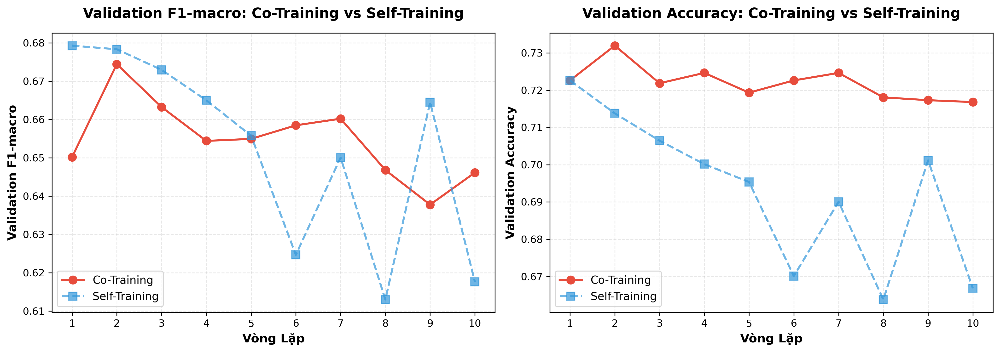
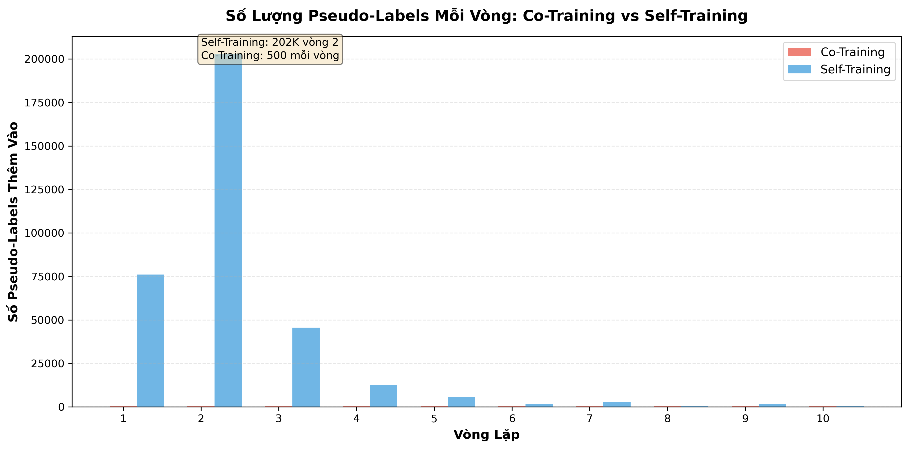
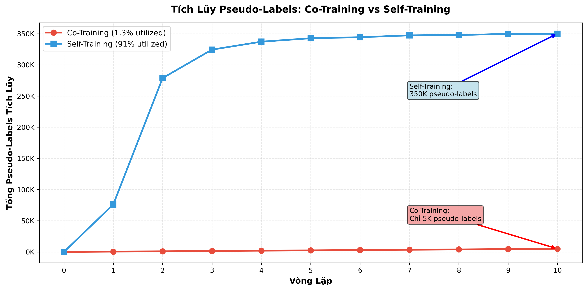
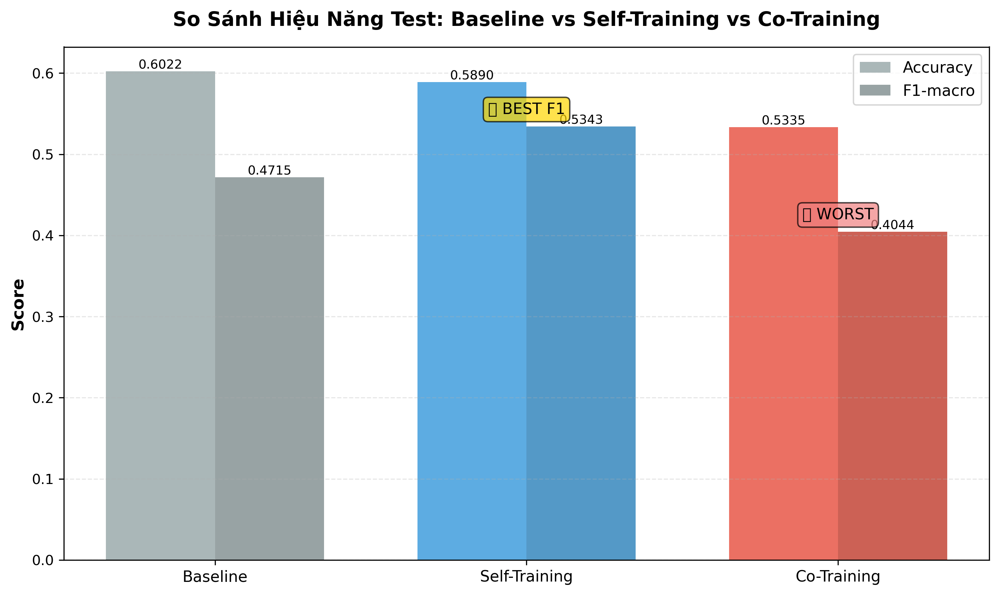
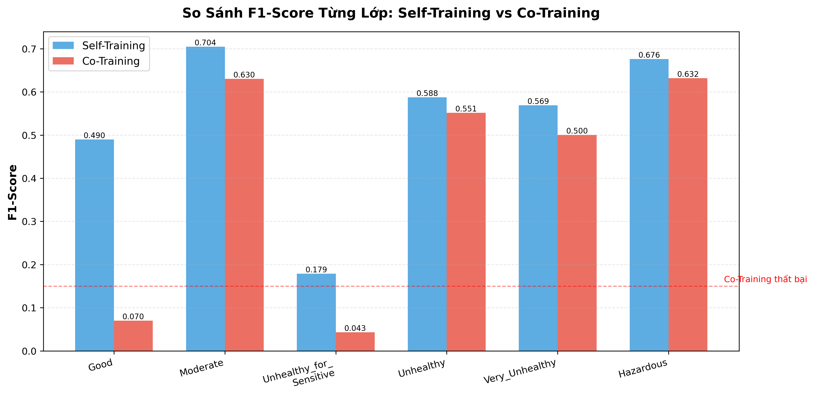

# Huấn Luyện Co-Training với Hai Views - Phân Tích Chi Tiết

> **Yêu cầu 2:** Huấn luyện thuật toán Co-training với hai mô hình và hai view đặc trưng. So sánh với self-training và baseline.

---

## Mục Lục

1. [Giới Thiệu](#1-giới-thiệu)
2. [Hai Views Đặc Trưng](#2-hai-views-đặc-trưng)
3. [Thiết Lập Thí Nghiệm](#3-thiết-lập-thí-nghiệm)
4. [Diễn Biến Qua Các Vòng](#4-diễn-biến-qua-các-vòng)
5. [Kết Quả So Sánh](#5-kết-quả-so-sánh)
6. [Phân Tích Thất Bại](#6-phân-tích-thất-bại)
7. [Kết Luận](#7-kết-luận)

---

## 1. Giới Thiệu

### Co-Training Là Gì?

**Co-Training** là phương pháp semi-supervised learning sử dụng **hai mô hình độc lập** học trên **hai views đặc trưng khác nhau**:

```
Khởi tạo:
├─ Model A học trên View 1 (features khí tượng)
└─ Model B học trên View 2 (features thời gian & địa điểm)

Vòng lặp:
├─ Model A predict trên unlabeled data
├─ Chọn top confident predictions từ A → thêm vào training của B
├─ Model B predict trên unlabeled data
├─ Chọn top confident predictions từ B → thêm vào training của A
└─ Cả 2 models re-train với data mới

Ý tưởng: Hai models "dạy" nhau, giảm confirmation bias
```

### Ưu Điểm Lý Thuyết

1. **Giảm Confirmation Bias**: Model A sai khác với Model B
2. **Bổ Sung Thông Tin**: Hai views cung cấp góc nhìn khác nhau
3. **Mutual Learning**: Models cải thiện song song

### Điều Kiện Thành Công

- Hai views phải **độc lập có điều kiện**
- Mỗi view phải **đủ mạnh** để train model tốt
- Không quá overlap giữa hai views

---

## 2. Hai Views Đặc Trưng

### View 1: Khí Tượng & Ô Nhiễm (Model A)

**Loại features:**
- **Chất ô nhiễm**: PM10, SO2, NO2, CO, O3
- **Khí tượng**: TEMP, PRES, DEWP, RAIN, WSPM  
- **Lag features**: Các giá trị trễ từ 1h, 3h, 24h trước

**Số lượng**: ~20-25 features

**Đặc điểm:**
- Features liên tục (continuous)
- Phản ánh **bản chất vật lý** của ô nhiễm không khí
- Có tính tương quan cao giữa các chất gây ô nhiễm

### View 2: Thời Gian & Địa Điểm (Model B)

**Loại features:**
- **Địa điểm**: station (12 trạm quan trắc)
- **Hướng gió**: wd (16 hướng)
- **Thời gian**: hour, dow (day of week), month, year
- **Derived**: hour_sin, hour_cos, is_weekend

**Số lượng**: ~15-20 features (sau one-hot encoding)

**Đặc điểm:**
- Features categorical (sau encoding thành binary)
- Phản ánh **patterns theo không gian và thời gian**
- Ít tương quan với View 1

### Độc Lập Có Điều Kiện?

**Lý thuyết:**
- View 1 (khí tượng) và View 2 (thời gian/địa điểm) **có liên quan**
- Ví dụ: Mùa đông (View 2) → Nhiệt độ thấp (View 1)
- Nhưng **không quyết định hoàn toàn** nhau

**Thực tế:**
- Độc lập yếu vì features có overlap ngữ nghĩa
- Cả hai views đều predict cùng target (AQI class)
- Có thể dẫn đến confirmation bias

---

## 3. Thiết Lập Thí Nghiệm

### Cấu Hình

| Tham Số | Giá Trị | Ý Nghĩa |
|---------|---------|---------|
| **Labeled Data** | 5% (~20,000 samples) | Giống self-training |
| **Unlabeled Data** | 95% (~384,000 samples) | Giống self-training |
| **Cutoff Date** | 2017-01-01 | Chia train/test theo thời gian |
| **Ngưỡng τ** | 0.90 | Cùng với self-training |
| **MAX_ITER** | 10 | Tối đa 10 vòng lặp |
| **MAX_NEW_PER_ITER** | 500 | Mỗi model thêm tối đa 500 samples/vòng |
| **MIN_NEW_PER_ITER** | 20 | Dừng nếu < 20 pseudo-labels |
| **VAL_FRAC** | 0.20 | 20% labeled data cho validation |
| **Models** | 2 × HistGradientBoostingClassifier | Cùng kiến trúc |

### Self-Labeling Strategy

**Quy trình mỗi vòng:**

1. **Model A** predict trên unlabeled pool
   - Chọn top 500 samples có confidence ≥ 0.90
   - Thêm vào training set của **Model B**

2. **Model B** predict trên unlabeled pool  
   - Chọn top 500 samples có confidence ≥ 0.90
   - Thêm vào training set của **Model A**

3. Cả 2 models re-train với data mới

**Lưu ý:**
- Hai models chia sẻ cùng unlabeled pool
- Có thể chọn cùng 1 sample (không vấn đề)
- Total pseudo-labels/vòng = 500 (không phải 1000)

### Code Implementation

```python
from src.semi_supervised_library import CoTrainingAQIClassifier

# Views tự động phân chia theo patterns
v2_patterns = ("station", "wd", "hour_", "dow", "month", 
               "is_weekend", "year", "day", "hour")

# View 2: Thời gian & địa điểm
view2 = [col for col in features if any(p in col for p in v2_patterns)]

# View 1: Còn lại (khí tượng & ô nhiễm)
view1 = [col for col in features if col not in view2]

# Train co-training
ct = CoTrainingAQIClassifier(
    tau=0.90,
    max_iter=10,
    max_new_per_iter=500,
    min_new_per_iter=20,
    val_frac=0.20
)

result = ct.fit(
    train_labeled, train_unlabeled, test_df,
    view1_cols=view1, view2_cols=view2
)
```

---

## 4. Diễn Biến Qua Các Vòng

### Validation Performance



| Vòng | Val Accuracy | Val F1-macro | Pseudo-labels | Unlabeled Pool |
|------|--------------|--------------|---------------|----------------|
| 1 | 0.7226 | 0.6502 | 500 | 383,962 → 383,462 |
| 2 | **0.7320** | **0.6744** | 500 | 383,462 → 382,962 |
| 3 | 0.7219 | 0.6632 | 500 | 382,962 → 382,462 |
| 4 | 0.7246 | 0.6544 | 500 | 382,462 → 381,962 |
| 5 | 0.7193 | 0.6549 | 500 | 381,962 → 381,462 |
| 6 | 0.7226 | 0.6585 | 500 | 381,462 → 380,962 |
| 7 | 0.7246 | 0.6602 | 500 | 380,962 → 380,462 |
| 8 | 0.7181 | 0.6468 | 500 | 380,462 → 379,962 |
| 9 | 0.7173 | 0.6378 | 500 | 379,962 → 379,462 |
| 10 | 0.7168 | 0.6461 | 500 | 379,462 → 378,962 |

### Nhận Xét Chi Tiết

**1. Vòng 1-2: Tăng Ban Đầu**
- Val Accuracy: 0.7226 → 0.7320 (+0.94%)
- Val F1: 0.6502 → 0.6744 (+2.42%)
- Hai models học tốt từ pseudo-labels đầu tiên

**2. Vòng 3-7: Dao Động**
- Val Accuracy dao động 0.7193-0.7246
- Val F1 dao động 0.6544-0.6632
- Không cải thiện ổn định

**3. Vòng 8-10: Giảm Dần**
- Val Accuracy giảm xuống 0.7168 (-1.52% so với peak)
- Val F1 giảm xuống 0.6461 (-2.83% so với peak)
- Dấu hiệu overfitting/confirmation bias

**4. Pseudo-Labels Dynamics**



- Mỗi vòng đều thêm đủ 500 samples
- Không bao giờ thiếu confident samples
- Tổng thêm: 5,000 pseudo-labels (1.3% unlabeled pool)



### So Sánh với Self-Training (τ=0.90)

| Metric | Self-Training Vòng 2 | Co-Training Vòng 2 |
|--------|----------------------|--------------------|
| Val Accuracy | 0.7138 | **0.7320** (+2.6%) |
| Val F1-macro | 0.6783 | 0.6744 (-0.6%) |
| Pseudo-labels | 202,713 (52.8%!) | 500 (0.13%) |

**Phát hiện:**
- Co-training thêm ít pseudo-labels hơn RẤT NHIỀU (405× ít hơn)
- Validation ban đầu cao hơn
- Nhưng không maintain được performance

---

## 5. Kết Quả So Sánh

### Test Metrics



| Phương Pháp | Test Accuracy | Test F1-macro | Pseudo-Labels | Cải thiện F1 |
|-------------|---------------|---------------|---------------|--------------|
| **Baseline Supervised** | **0.6022** | 0.4715 | 0 | - |
| **Self-Training (τ=0.90)** | 0.5890 | **0.5343** | 350,019 | +13.3% |
| **Co-Training (τ=0.90)** | 0.5335 | 0.4044 | 5,000 | **-14.2%** |

### Phân Tích Chi Tiết Từng Lớp



| Lớp AQI | Baseline F1 | Self-Train F1 | Co-Train F1 | So sánh |
|---------|-------------|---------------|-------------|---------|
| **Good** | 0.46 | **0.4897** | 0.0702 | Co-train RẤT TỆ (-86%) |
| **Moderate** | 0.67 | **0.7045** | 0.6302 | Co-train giảm (-11%) |
| **Unhealthy_for_Sensitive** | 0.12 | **0.1789** | 0.0430 | Co-train tệ (-76%) |
| **Unhealthy** | 0.59 | 0.5877 | **0.5513** | Co-train giảm (-6%) |
| **Very_Unhealthy** | 0.51 | **0.5689** | 0.5002 | Co-train giảm (-12%) |
| **Hazardous** | 0.66 | **0.6762** | 0.6316 | Co-train giảm (-7%) |
| **Macro Avg** | 0.4715 | **0.5343** | 0.4044 | Co-train TỆ NHẤT |

### Confusion Matrix Insights

**Co-Training có vấn đề nghiêm trọng:**
- Recall cho **Good** = 3.7% (chỉ nhận đúng 38/1032 samples!)
- Recall cho **Unhealthy_for_Sensitive** = 2.3% (chỉ 50/2166!)
- Model quá bias về lớp đa số (Moderate, Unhealthy)

**So sánh recall:**

| Lớp | Baseline | Self-Train | Co-Train | Nhận xét |
|-----|----------|------------|----------|----------|
| Good | ~45% | 39.1% | **3.7%** | Co-train sụp đổ |
| Moderate | ~85% | 84.1% | **90.4%** | Co-train quá bias |
| Unhealthy_for_Sensitive | ~12% | 13.5% | **2.3%** | Co-train bỏ qua lớp này |

---

## 6. Phân Tích Thất Bại

### Tại Sao Co-Training Tệ Hơn?

**1. Hai Views Không Thực Sự Độc Lập**

```
Lý thuyết: Views độc lập → errors không tương quan
Thực tế:   Cả 2 views đều predict cùng target
           → Errors có patterns giống nhau
           → Confirmation bias tăng gấp đôi
```

**Bằng chứng:**
- Cả View 1 và View 2 đều có thông tin về seasonality
- View 1: Nhiệt độ, áp suất (theo mùa)
- View 2: Month, day of year (trực tiếp)
- Khi một view sai → view kia cũng sai tương tự

**2. MAX_NEW_PER_ITER Quá Nhỏ (500)**

```
Self-training: Thêm 76K-202K pseudo-labels/vòng
Co-training:   Chỉ thêm 500/vòng (0.13% unlabeled pool)
```

**Hậu quả:**
- Model không học đủ từ unlabeled data
- Chỉ 1.3% unlabeled pool được sử dụng (vs 91% của self-training)
- Không đủ data để cải thiện lớp thiểu số

**3. Một Model Yếu Hơn**

**View 2 (thời gian & địa điểm) yếu hơn View 1:**
- Features categorical ít thông tin hơn continuous
- 12 trạm + 16 hướng gió không đủ phân biệt 6 lớp AQI
- Model B cho pseudo-labels kém chất lượng

**Kết quả:**
- Model A nhận nhiễu từ Model B
- Model B cũng nhận nhiễu từ Model A
- Spiral downward thay vì mutual improvement

**4. Confirmation Bias Kép**

```
Self-training: Model A ← Pseudo-labels từ chính A
               └─ Confirmation bias đơn

Co-training:   Model A ← Pseudo-labels từ B
               Model B ← Pseudo-labels từ A
               └─ Nếu A, B sai giống nhau → Bias kép!
```

**Quan sát:**
- Validation tốt ban đầu (vòng 1-2)
- Sau đó không cải thiện mà giảm dần
- Test performance tệ hơn cả baseline

### Validation vs Test Discrepancy

| Metric | Val (vòng 2) | Test | Gap |
|--------|--------------|------|-----|
| Accuracy | 0.7320 | 0.5335 | **-0.1985** (-27%) |
| F1-macro | 0.6744 | 0.4044 | **-0.2700** (-40%) |

**Giải thích:**
- Validation set quá nhỏ (20% của 5% labeled = 1% data)
- Model overfit lên validation set
- Không generalize ra test set

### So Sánh Với Self-Training

**Tại sao self-training tốt hơn?**

1. **Sử dụng tất cả features**
   - Self-training: Model học trên ALL features
   - Co-training: Mỗi model chỉ thấy 1 subset

2. **Thêm nhiều pseudo-labels hơn**
   - Self-training: 350K pseudo-labels (91%)
   - Co-training: 5K pseudo-labels (1.3%)

3. **Đơn giản hơn**
   - Self-training: 1 model, dễ tune
   - Co-training: 2 models, phức tạp hơn

4. **Confirmation bias có thể chấp nhận được**
   - Với τ=0.90, self-training đã cẩn thận
   - Early stopping ở vòng 5 tránh được overfitting

---

## 7. Kết Luận

### Tổng Kết

**Co-Training THẤT BẠI trong trường hợp này:**

```
━━━━━━━━━━━━━━━━━━━━━━━━━━━━━━━━━━━━━━━━━━━━━
                  RANKING
━━━━━━━━━━━━━━━━━━━━━━━━━━━━━━━━━━━━━━━━━━━━━
1. Self-Training    F1=0.5343  (+13.3% vs baseline)
2. Baseline         F1=0.4715  
3. Co-Training      F1=0.4044  (-14.2% vs baseline)
━━━━━━━━━━━━━━━━━━━━━━━━━━━━━━━━━━━━━━━━━━━━━
```

### Lý Do Thất Bại

1. **Hai views không đủ độc lập**
   - Có overlap về information (seasonality)
   - Errors tương quan → confirmation bias kép

2. **Tham số chưa phù hợp**
   - MAX_NEW_PER_ITER=500 quá nhỏ
   - Chỉ sử dụng 1.3% unlabeled data

3. **View 2 yếu hơn View 1**
   - Categorical features ít thông tin
   - Pseudo-labels kém chất lượng

4. **Dataset không phù hợp với co-training**
   - Khó tách thành 2 views độc lập
   - Self-training đã tận dụng tốt data rồi

### Khuyến Nghị

**Khi nào NÊN dùng Co-Training:**
- Có 2 nguồn data độc lập rõ ràng (ví dụ: text + image)
- Mỗi view đủ mạnh để train model tốt riêng
- Dataset lớn, có thể chia views không mất nhiều information

**Khi nào KHÔNG NÊN dùng Co-Training:**
- Chỉ có 1 loại features (như trường hợp này)
- Hai views có overlap cao về information
- Self-training đã cho kết quả tốt

**Cải thiện Co-Training (nếu muốn thử):**
1. Tăng MAX_NEW_PER_ITER lên 5000-10000
2. Dùng different τ cho 2 models (ví dụ: 0.85 và 0.95)
3. Thử chia views khác: pollution vs weather (thay vì pollution+weather vs time)
4. Ensemble cả 2 models thay vì chọn 1

### Bài Học

**Semi-supervised learning không phải lúc nào cũng tốt hơn:**
- Cần điều kiện phù hợp
- Tham số quan trọng
- Đơn giản đôi khi tốt hơn phức tạp

**Self-training là lựa chọn tốt cho project này:**
- Đơn giản, dễ implement
- Tận dụng được 91% unlabeled data
- F1-macro tăng 13.3% so với baseline

---

## Tài Liệu Tham Khảo

### Files Liên Quan

- **Code:** [notebooks/semi_co_training.ipynb](notebooks/semi_co_training.ipynb)
- **Library:** [src/semi_supervised_library.py](src/semi_supervised_library.py)
- **Metrics:** [data/processed/metrics_co_training.json](data/processed/metrics_co_training.json)
- **Predictions:** [data/processed/predictions_co_training_sample.csv](data/processed/predictions_co_training_sample.csv)

### Liên Kết

- [← Quay lại Self-Training Analysis](./BLOG_SELF_TRAINING.md)
- [README.md](./README.md) - Tổng quan project

---

<div align="center">

**Blog phân tích Co-Training - Yêu cầu 2**

*Data Mining - Air Quality Prediction Project*

</div>
